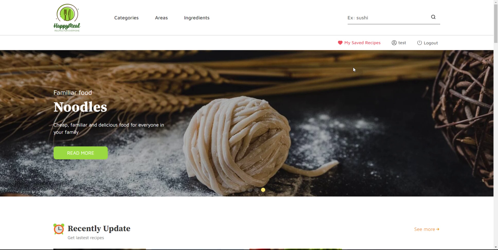
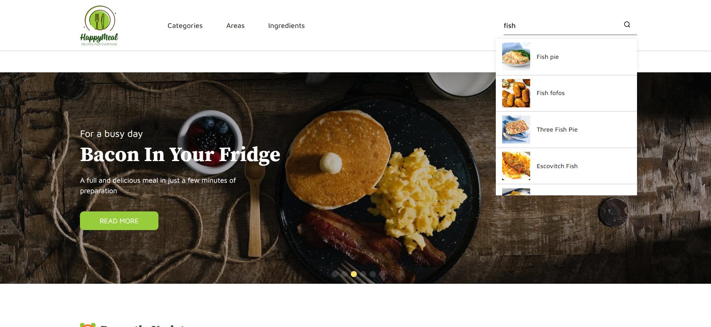
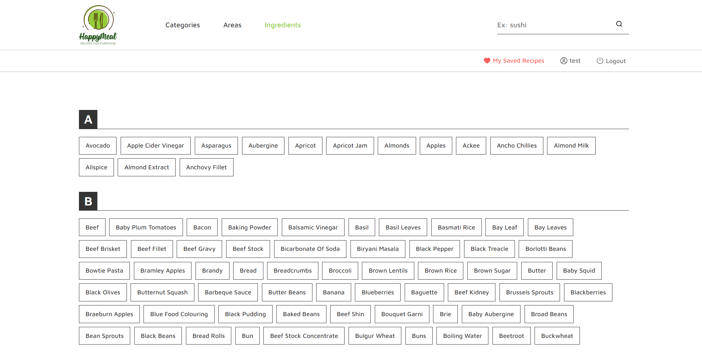
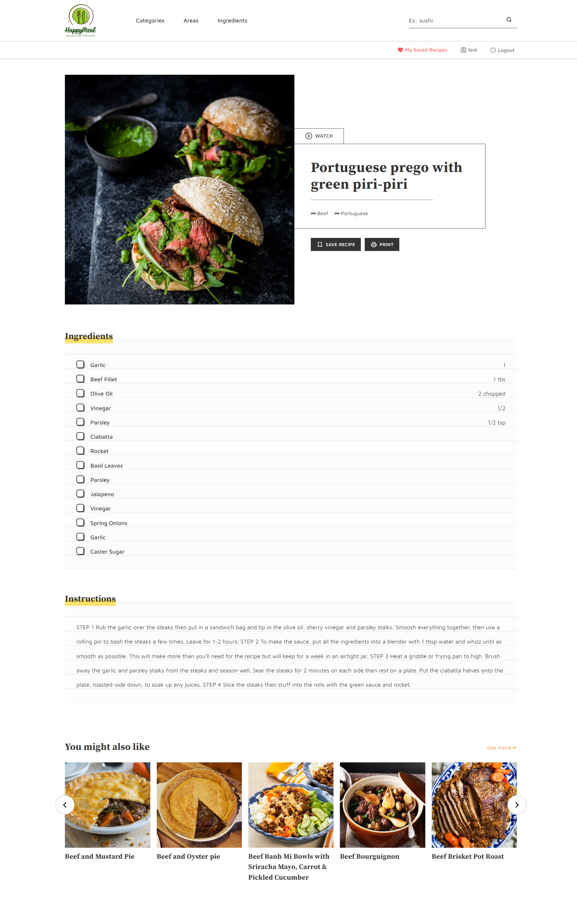
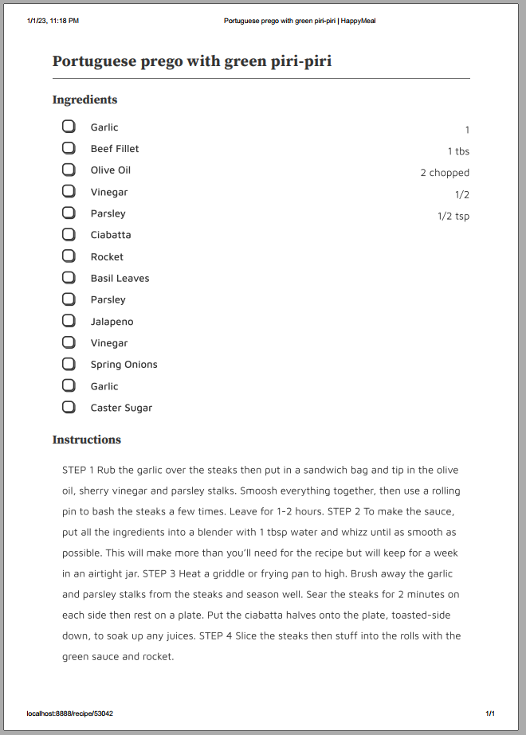
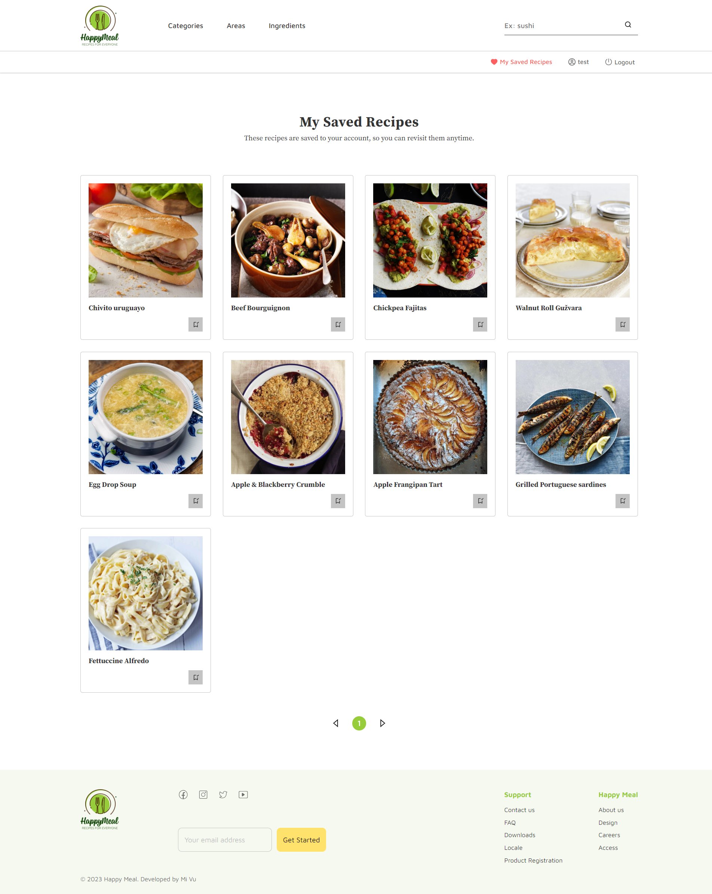

# Happy Meal

This is a website that allows users to view recipes, register, log in, bookmark their favorite recipes and search for recipes in different ways.

## Table of contents

- [Live demo](#live-demo)
- [Built with](#built-with)
- [The features](#features)

## Live demo

[https://ourhappymeals.netlify.app/](https://ourhappymeals.netlify.app/)

## Built with

- Semantic HTML5 markup
- CSS/SCSS modules
- ReactJS (JavaScript Library)
- Redux Toolkit
- Swiper, react-hot-toast, react-paginate, react-router-dom, react-helmet-async, react-lazy-load-image-component, react-tooltip, etc.
- Axios
- Firebase
- Netlify Functions
- [TheMealDB API](https://www.themealdb.com/api.php)

### Features

Users are able to:

- **Search for recipes, see results when typing**

  

- **Browse recipes by categories, areas, ingredients.**

  

- **View the list of recipes sorted alphabetically**

  

- **View recipes with a nice design.**

  

- **Print a recipe with a preformatted page**

  

- **User: Register, login (email or google account), verify email, change profile information, reset password and delete account**

  
  
  

- **Save/remove favorite recipes (when logging in)**
  
